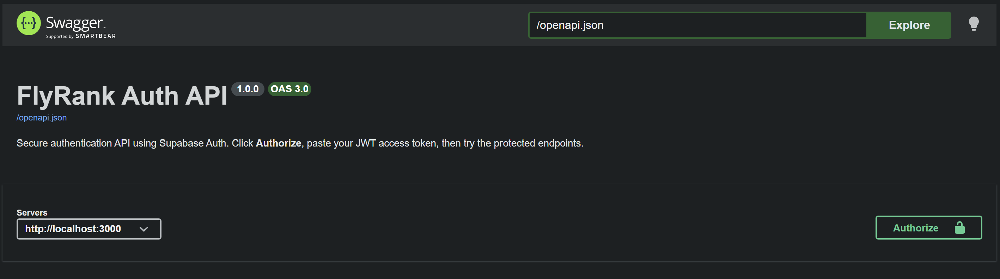
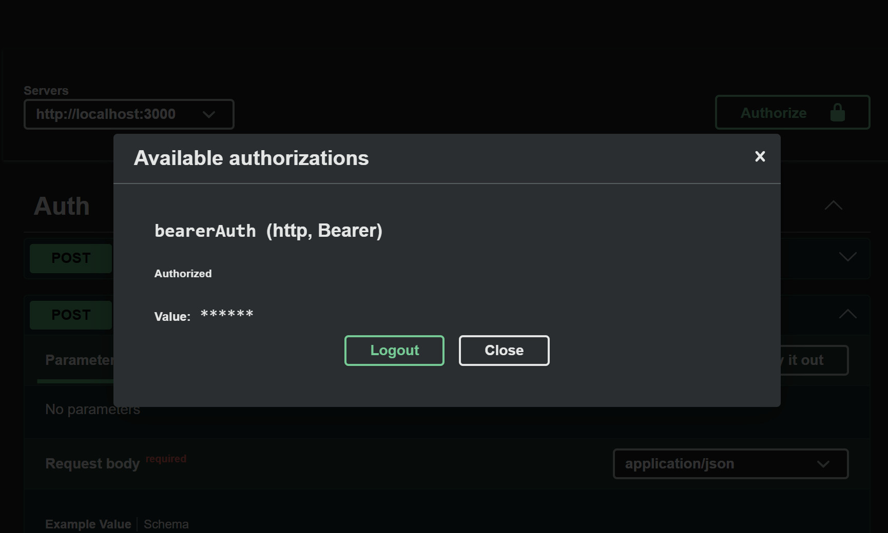
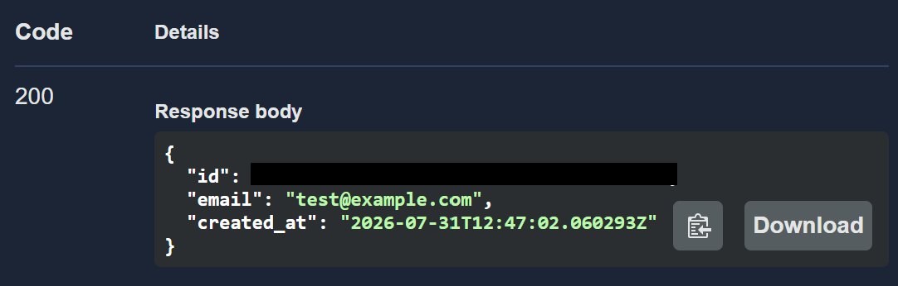
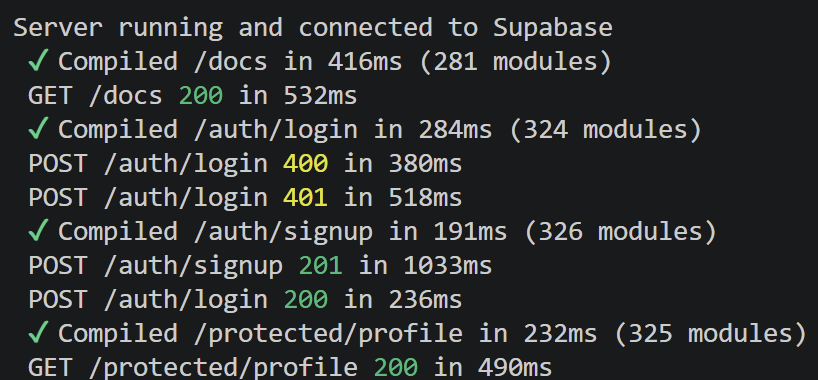

# FlyRank Auth API

So this is the backend for my auth project. I built it to practice real authentication, not just fake routes that pretend to check stuff. It uses Supabase to handle sign up, log in, and log out, and it hands out JWT tokens so I can lock down certain routes. Protected routes only work if you send a valid token in the `Authorization` header. If the token is missing or fake, you get a 401 and that's that.

The coolest part is probably the Swagger UI at `/docs`. You can see every route, click the Authorize lock, paste your token, and actually test the protected endpoints right from the browser. No Postman needed.

## How it works

The whole thing is a trust triangle. The client talks to Supabase, Supabase gives back a JWT, and my backend verifies that JWT before opening the door.

1. Sign up or log in sends your email and password straight to Supabase.
2. Supabase checks the credentials and gives back an access token (a JWT).
3. The client sends that token in the `Authorization: Bearer <token>` header on every protected request.
4. My server verifies the token with Supabase. Good token, you get your data. Bad token, 401.

## What I used

- Next.js (route handlers, so everything lives under `app/`)
- @supabase/supabase-js for auth
- swagger-ui-dist for the docs page
- dotenv for environment variables
- Git and GitHub for saving my work

## What you need before starting

- Node.js (I ran it on a recent version and it worked)
- A free Supabase project (just go to supabase.com and make one)

## Setting up your environment variables

The server needs to know where your Supabase project lives and which key to use. There's a template file already in the repo.

1. Copy the example file and rename it:

```bash
cp .env.example .env
```

2. Open `.env` and fill in your real values. You can find the project URL and anon key in your Supabase dashboard under Project Settings, then API.

```
SUPABASE_URL=https://your-project-ref.supabase.co
SUPABASE_KEY=your-anon-key-here
PORT=3000
```

Important: `.env` is gitignored, so your keys never end up on GitHub. Don't ever commit it.

## How to run it

```bash
npm install
npm run dev
```

You should see "Server running and connected to Supabase" and then the server is live on `http://localhost:3000`.

Once it's running:

- Open `http://localhost:3000/docs` for the interactive Swagger UI.
- To get a token, expand POST /auth/login, hit Try it out, put your email and password in the body, and Execute. Copy the `access_token` from the response.
- Click the Authorize button at the top, paste the token, close the box.
- Now Try it out on `/protected/profile` and it should return your user info.

## API reference

| Method | Endpoint | Auth required | What it does |
|--------|----------|---------------|--------------|
| POST | `/auth/signup` | No | Creates a new account |
| POST | `/auth/login` | No | Logs you in and returns the JWT |
| POST | `/auth/logout` | Yes | Ends your session |
| GET | `/protected/profile` | Yes | Returns your profile info |
| GET | `/protected/dashboard` | Yes | Returns your private dashboard |
| GET | `/public/info` | No | Public info, no token needed |
| GET | `/api/health` | No | Health check, just confirms the server is up |

## Screenshots

Here's the Swagger UI with all the routes and the Authorize lock:



Logging in through Swagger and getting a token:



Testing /protected/profile with a valid token:



The server running in the terminal:


